# MMSS Registration Application Process

The MMSS registration opens at the end of December every year and lasts through June. The link to the MMSS Registration application will be included in all advertising materials sent to potential or returning applicants ([https://sites.lsa.umich.edu/mmss/](https://sites.lsa.umich.edu/mmss/)).

## Sign Up Process

To begin the registration process, MMSS Applicants will need to create an account in the MMSS Registration Application. Signing up to the application creates a user record. Once the account is created, the MMSS Applicant can always change their password if desired. Returning participants can use the same email and password for any future camps they are interested in.
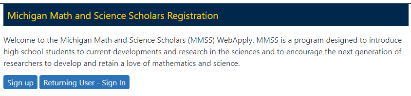

When the MMSS Applicants click on the Sign Up Button, they will:
1.  Enter an Email.
2.  Create and confirm a password (10 character minimum).
3.  Click Sign Up.
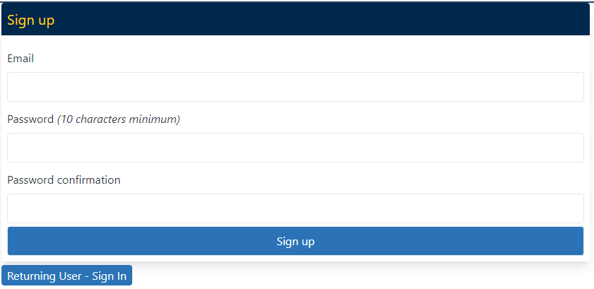
**NOTE**: After signing up, returning MMSS Applicants can click on the Returning User - Sign In button to sign in and continue their application.  

## Registration Process

Once signed up and signed in, MMSS Applicants will start the Registration process to create their Application Details. Returning MMSS Participants can edit this information if any information changes. They will be taken to a page with instructions.
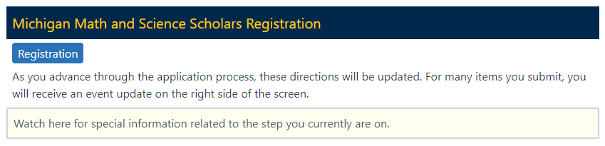

The MMSS Applicant will click on **Registration** and fill out of the following information:

1. Applicant Information
    1. First Name
    2. Middle Name (optional)
    3. Last Name
    4. Address
    5. City
    6. State (there is an option for international applicants)
    7. State/Province/Region (for international applicants)
    8. Country
    9. Postal Code
    10. Phone
    11. Birthday
    12. Shirt Size
    13. Diet Restrictions

2. Parent Information
    1. Parent/Guardian Full Name
    2. Parent/Guardian Address
    3. Parent/Guardian City
    4. Parent/Guardian State
    5. Parent/Guardian Postal Code
    6. Parent/Guardian Country
    7. Parent/Guardian phone
    8. Parent/Guardian email

3. Applicant Demographics
    1. Gender
    2. US Citizen
    3. Race/Ethnicity

Once the MMSS Applicant fills out the form and clicks on Register, they are taken to the Camp Application.

## Camp Application
At this point in the application, the MMSS Applicant will apply to the current application cycle. 
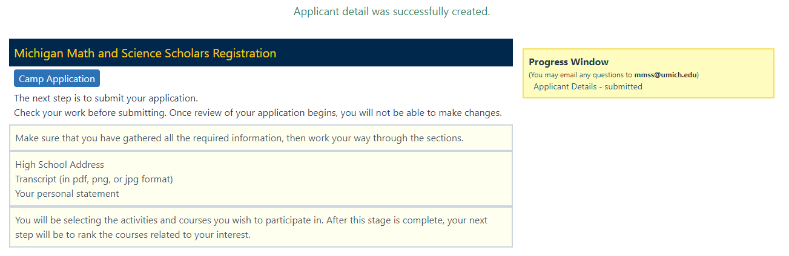

At any point in the MMSS Registration Application, MMSS Applicants can leave the application and come back later. When they sign back into the registration application, the Camp Application landing page has a Progress Window to let them know where they are in the application process.
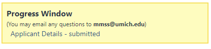
When the MMSS Applicant clicks on **Camp Application**, they are taken to the Camp Application Form.

### Session Section

The first section of the application is where MMSS Applicants select the session(s) they want to participate in. MMSS Applicants can choose any of the following:

-   **Any Session**: The MMSS Applicant is interested in any one session available that summer.
    
-   **Individual Sessions**: MMSS Applicants can select the specific session.
    
-   **Multiple Session**: MMSS Applicants can select more than one session.

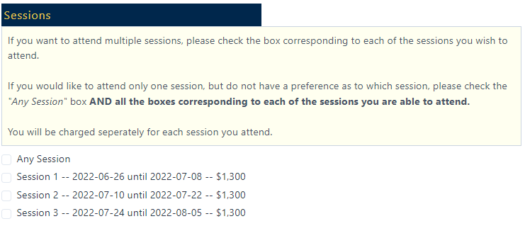

Above is an example of the Session details that may be offered during the summer. MMSS Administrators will configure these activities in the [MMSS AdministratorUser Interface](https://mmss-registration.math.lsa.umich.edu/admin) (under the [Camp Set up > Sessions](https://docs.google.com/document/d/1DMKtl88GnAAWM5Fkztdc3-tN92SZq2pm1a8yJfxccmE/edit#heading=h.i7lrtkix1ni)). Next, MMSS Applicants will select any Activities or Services that they may be interested in.

### Activities & Services

Below is an example of the type of Activities & Services that may be offered during the summer. MMSS Administrators will configure these activities in the [MMSS Administrator User Interface](https://mmss-registration.math.lsa.umich.edu/admin) (under the [Camp Set up > Activities](https://docs.google.com/document/d/1DMKtl88GnAAWM5Fkztdc3-tN92SZq2pm1a8yJfxccmE/edit#heading=h.ug5i3phfw3ix)).

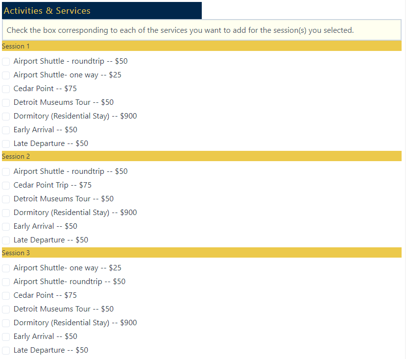

### Courses

Below is an example of the type of Courses that may be offered during the summer. MMSS Administrators will configure these activities in the [MMSS Administrator User Interface](https://mmss-registration.math.lsa.umich.edu/admin) (under the [Camp Set up > Courses](https://docs.google.com/document/d/1DMKtl88GnAAWM5Fkztdc3-tN92SZq2pm1a8yJfxccmE/edit#heading=h.belghepvwrqb)).

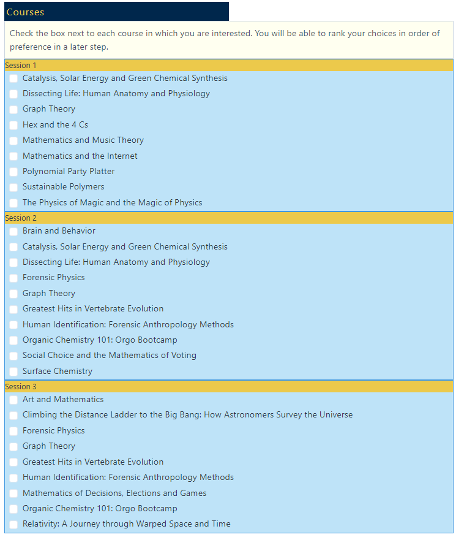

MMSS Applicants will be able to rank the courses later in the application process.

### Applicant School History
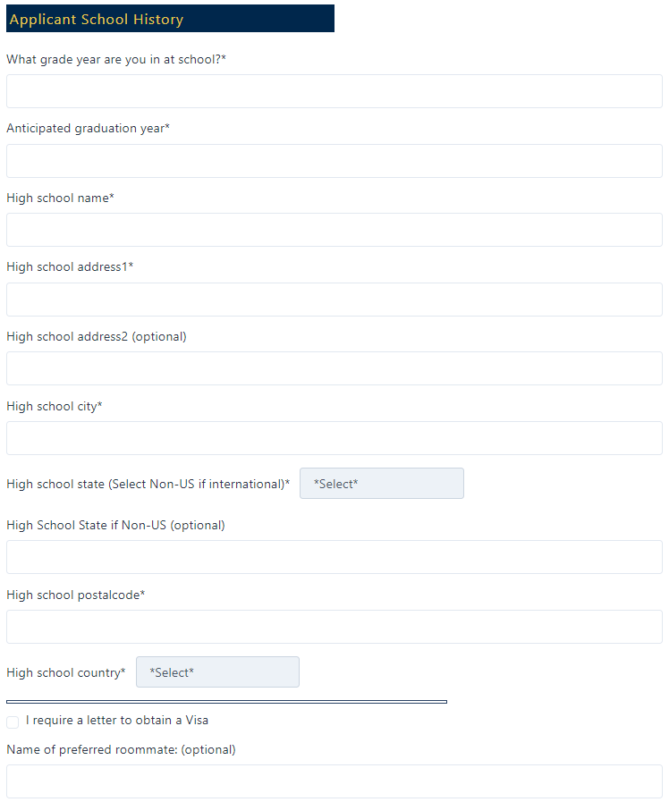

### Student Personal Statement
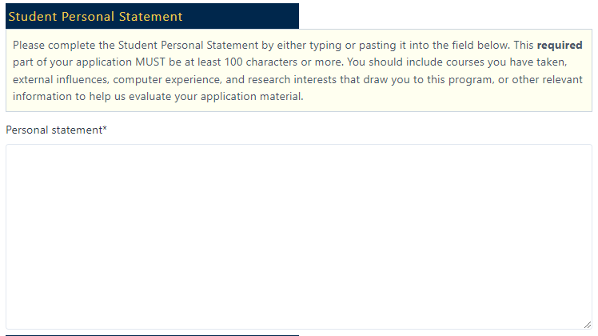

### Transcripts
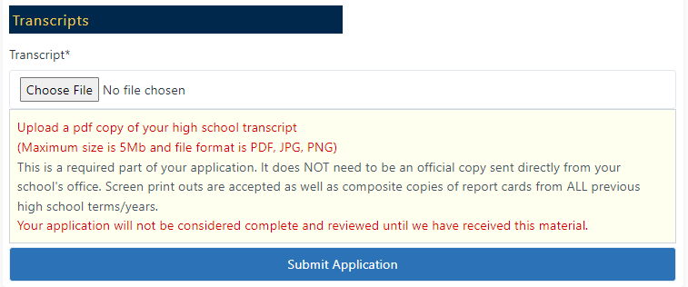

Once the Transcript is uploaded to the application and the MMSS Applicant clicks on **Submit Application**, the next screen is the course rankings.

### Course Rankings
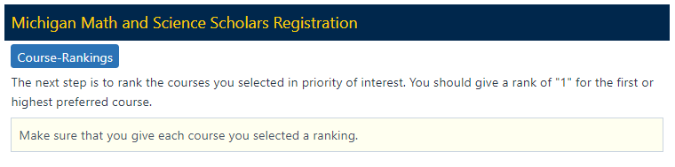

Click on **Course Rankings**

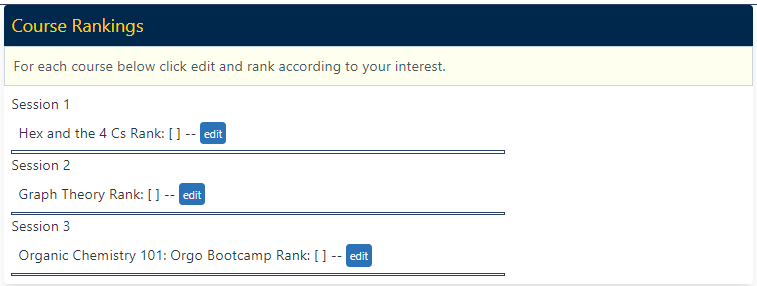

MMSS Applicants will click on Edit and select their ranking for the course

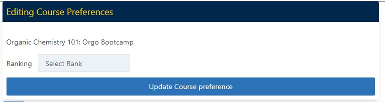

### Letter of Recommendation
MMSS Applicants must indicate their Designated Recommender to complete the application.

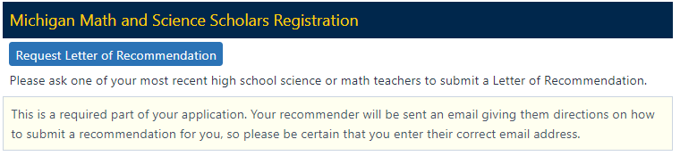

Click on Request **Letter of Recommendation.**

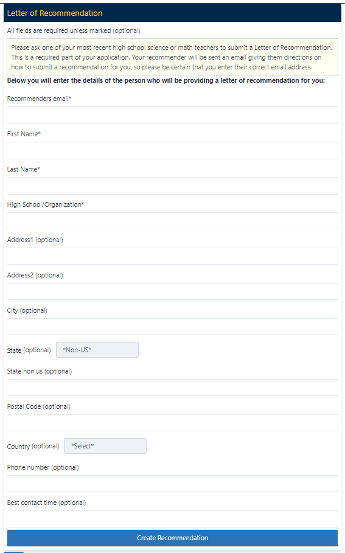

Once the MMSS Applicant completes this part of the application, an email is sent to the Designated Recommender indicated on the form. That email will contain a link to the MMSS Registration System and the [Designated Recommender](https://docs.google.com/document/d/1DMKtl88GnAAWM5Fkztdc3-tN92SZq2pm1a8yJfxccmE/edit#heading=h.i7obr51sefjy) will have a form to complete.

### Application Fee Payment
MMSS Applicants will need to pay the $100 application fee.

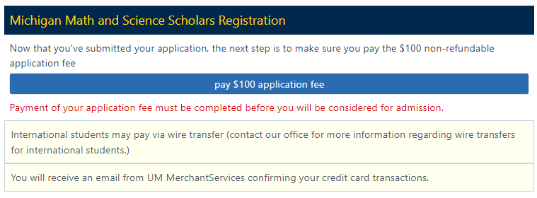

When the MMSS Applicant clicks on **Pay Application fee**, they will be taken to the NelNet payment system.

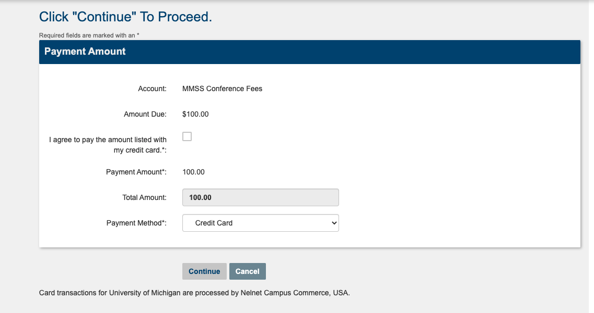

MMSS Applicants will follow the instruction after this screen to complete payment. Once the MMSS Applicant submits the payment, the application status will change to submitted.

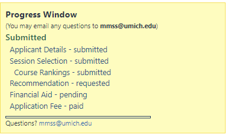

MMSS Applicants will receive a confirmation email of the submitted application. At this point, applicants cannot change their session selections. For the application to be complete, the MMSS Applicant’s Designated Recommender must submit their [Letter of Recommendation](https://docs.google.com/document/d/1DMKtl88GnAAWM5Fkztdc3-tN92SZq2pm1a8yJfxccmE/edit#heading=h.i7obr51sefjy).

At this point, the MMSS Applicant has submitted all required materials. They have the option to request Financial Aid.